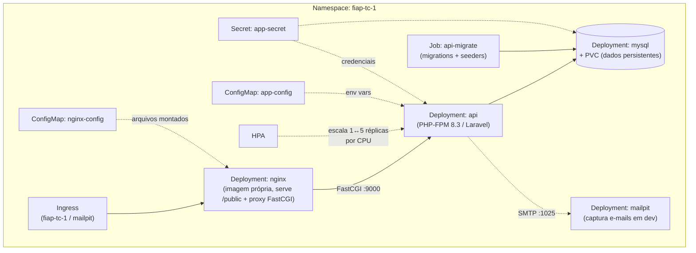
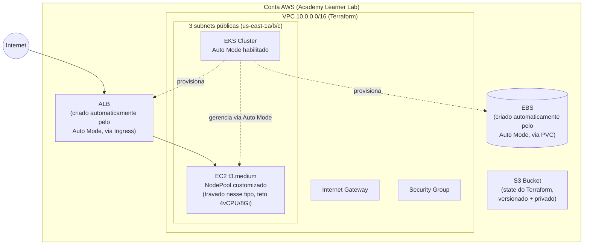
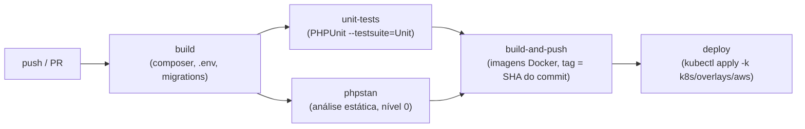

# Infraestrutura — Kubernetes, Terraform e CI/CD

Este documento cobre a infraestrutura do projeto: como a aplicação foi containerizada, como ela roda em Kubernetes (local e AWS), como a infraestrutura da AWS é provisionada via Terraform, e como o pipeline de CI/CD conecta tudo isso.

## Índice

- [Arquitetura](#arquitetura)
  - [Componentes da aplicação](#componentes-da-aplicação)
  - [Infraestrutura provisionada](#infraestrutura-provisionada)
  - [Fluxo de deploy](#fluxo-de-deploy)
- [Terraform](#terraform)
  - [Recursos criados](#recursos-criados)
  - [Como aplicar](#como-aplicar)
- [Instruções: execução local](#instruções-execução-local)
- [Instruções: deploy em Kubernetes](#instruções-deploy-em-kubernetes)
- [Instruções: provisionamento da infraestrutura com Terraform](#instruções-provisionamento-da-infraestrutura-com-terraform)

---

## Arquitetura

### Componentes da aplicação

A aplicação roda como um conjunto de recursos Kubernetes dentro do namespace `fiap-tc-1`, definidos em `k8s/base/` (compartilhado entre ambientes) e customizados por `k8s/overlays/local/` ou `k8s/overlays/aws/` via [Kustomize](https://kustomize.io/).



**Componentes:**

| Componente | Papel | Arquivo(s) |
|---|---|---|
| `api` | PHP-FPM 8.3 rodando o Laravel; imagem própria (`docker/php-fmp/Dockerfile`) | `k8s/base/06-api-deployment.yaml`, `07-api-service.yaml` |
| `nginx` | Serve os estáticos do Laravel e repassa `.php` via FastCGI pro `api`; imagem própria (`docker/nginx/Dockerfile`) | `k8s/base/09-nginx-deployment.yaml`, `10-nginx-service.yaml`, `08-nginx-configmap.yaml` |
| `mysql` | Banco de dados; `Deployment` com `strategy: Recreate` (evita dois Pods montando o mesmo PVC) | `k8s/base/04-mysql-deployment.yaml`, `03-mysql-pvc.yaml`, `05-mysql-service.yaml` |
| `mailpit` | Captura e-mails enviados em dev, sem entregar de verdade | `k8s/base/12-mailpit-deployment.yaml`, `13-mailpit-service.yaml` |
| `api-migrate` | `Job` que roda `php artisan migrate --seed --force`; tem um `initContainer` que espera o MySQL responder antes de rodar | `k8s/base/15-api-migrate-job.yaml` |
| `HPA` | Escala o Deployment `api` entre 1 e 5 réplicas, alvo de 50% de uso de CPU | `k8s/base/11-api-hpa.yaml` |
| `Ingress` | Roteamento HTTP externo, por host (`app` vs `mailpit`) | `k8s/base/14-ingress.yaml` + patch no overlay AWS |
| `ConfigMap`/`Secret` | Configuração e credenciais, injetadas via `envFrom` | `k8s/base/01-configmap.yaml`, `02-secret.yaml` (não versionado, veja `.example`) |

### Infraestrutura provisionada



**O que é criado por quem:**

- **Terraform** cria: VPC, subnets, Internet Gateway, route table, Security Group, o cluster EKS em si, e os *access entries* que permitem autenticação via `kubectl`.
- **EKS Auto Mode** (não o Terraform) cria, em resposta a objetos do Kubernetes: as instâncias EC2 (via `NodePool`/`NodeClass`), o **ALB** (via `Ingress`), e os volumes **EBS** (via `PersistentVolumeClaim`). Por isso alguns recursos AWS "aparecem" sem estar no `terraform state` — eles são gerenciados pelo Kubernetes, não pelo Terraform.
- Não usamos **RDS** nem **EBS CSI driver**/**AWS Load Balancer Controller** manuais — o Auto Mode do EKS já resolve storage e load balancing nativamente, com as permissões IAM já configuradas na conta de Academy.

### Fluxo de deploy



O deploy só acontece se **todas** as etapas anteriores passarem (`needs:` no GitHub Actions). Veja detalhes em [`.github/workflows/app.yml`](../.github/workflows/app.yml).

---

## Terraform

Código em [`terraform/`](../terraform/).

### Recursos criados

| Arquivo | Recurso(s) | O que faz |
|---|---|---|
| `vpc.tf` | `aws_vpc.vpc_fiap` | Rede privada isolada (`10.0.0.0/16`) |
| `subnet.tf` | `aws_subnet.subnet_public[0..2]` | 3 subnets públicas, uma por zona de disponibilidade (`us-east-1a/b/c`), com as tags `kubernetes.io/role/elb` e `kubernetes.io/cluster/<nome>` que o Auto Mode precisa pra saber onde colocar o ALB |
| `internet-g.tf` | `aws_internet_gateway.igw` | Permite tráfego de/para a internet |
| `route-t.tf` | `aws_route_table.rt_public` + associações | Roteia tráfego das subnets pro Internet Gateway |
| `sg.tf` | `aws_security_group.sg` | Security Group anexado ao cluster (HTTP liberado, egress total) |
| `data.tf` | `data.aws_iam_role.eks_cluster`, `data.aws_iam_role.eks_node` | Referencia os IAM Roles **já existentes** na conta de Academy (não criamos roles novos — a conta bloqueia isso) |
| `eks-cluster.tf` | `aws_eks_cluster.cluster` | O cluster EKS, com **Auto Mode** habilitado (`compute_config`, `storage_config`, `kubernetes_network_config.elastic_load_balancing`) |
| `access-entry.tf` | `aws_eks_access_entry`, `aws_eks_access_policy_association` | Autoriza o principal IAM `voclabs` (usado pelo `kubectl`) como admin do cluster |
| `bucket.tf` | `aws_s3_bucket.bucket_backend` + versionamento + bloqueio de acesso público | Bucket que guarda o *state* do próprio Terraform |
| `backend.tf` | (config de backend) | Aponta o Terraform pra usar esse bucket como state remoto |
| `providers.tf` | provider `aws` | Configuração de provider e região |
| `vars.tf` | variáveis | Nome do projeto, região, CIDR da VPC, tags, tipo de instância |
| `output.tf` | outputs | Expõe `vpc_id`, `vpc_cidr`, `subnet_id`, `subnet_cidr` |
| `iam-role.tf` | *(comentado)* | Mantido só como referência de como seria numa conta AWS sem a limitação da Academy — não é usado |

**Importante:** o Terraform **não** gerencia os manifestos Kubernetes da aplicação (isso é responsabilidade do `k8s/` + Kustomize) — essa separação foi deliberada: infraestrutura muda raramente e é sensível, aplicação muda o tempo todo.

### Como aplicar

O bucket do state (`bucket.tf`) tem um problema de "ovo e galinha": não dá pra usar um backend S3 que ainda não existe. Por isso, a primeira aplicação é feita em duas fases — depois disso, aplicações normais.

**Primeira vez (bootstrap do backend):**

```bash
cd terraform
mv backend.tf backend.tf.disabled   # desativa o backend remoto temporariamente
terraform init                       # inicializa com state local
terraform apply \
  -target=aws_s3_bucket.bucket_backend \
  -target=aws_s3_bucket_versioning.bucket_backend \
  -target=aws_s3_bucket_public_access_block.bucket_backend
mv backend.tf.disabled backend.tf   # reativa o backend
terraform init                       # migra o state local pro bucket (confirme "yes")
```

**Uso normal (a partir daqui):**

```bash
cd terraform
terraform init
terraform plan
terraform apply
```

Veja o passo a passo completo (incluindo os objetos Kubernetes que faltam depois do `apply`) em [Instruções: provisionamento da infraestrutura com Terraform](#instruções-provisionamento-da-infraestrutura-com-terraform).

---

## Instruções: execução local

Pra desenvolvimento do dia a dia (edição de código com resultado imediato), use **Docker Compose** — não Kubernetes. Kubernetes serve pra validar comportamento de produção (réplicas, autoscaling, rolling update), não pra iteração rápida de código, já que a imagem precisa ser rebuildada a cada mudança.

```bash
cp .env.example .env
docker compose up -d
docker compose exec api php artisan key:generate
docker compose exec api php artisan migrate --seed
```

A API fica disponível em `http://localhost:9000`, o Mailpit em `http://localhost:8025`.

Pra rodar os testes localmente:

```bash
docker compose exec api vendor/bin/phpunit
docker compose exec api vendor/bin/phpstan analyse
```

---

## Instruções: deploy em Kubernetes

### Cluster local (Docker Desktop)

Pré-requisito: Docker Desktop com Kubernetes habilitado.

```bash
kubectl config use-context docker-desktop
kubectl apply -k k8s/overlays/local
kubectl get all -n fiap-tc-1
```

Acesso: `http://fiap-tc-1.localtest.me:9080/api/test` (o Ingress local usa `cloud-provider-kind` pra simular um LoadBalancer).

### Cluster na AWS

Pré-requisito: o cluster já ter sido criado via Terraform (veja seção seguinte).

```bash
aws eks update-kubeconfig --name eks-fiap-tc-1-terraform-backend --region us-east-1 --alias eks-fiap-tc-1
kubectl config use-context eks-fiap-tc-1
kubectl apply -k k8s/overlays/aws
kubectl get all -n fiap-tc-1
```

Acesso: pegue o endereço do ALB e use o cabeçalho `Host` correto (sem domínio próprio configurado ainda):

```bash
ALB=$(kubectl get ingress fiap-tc-1 -n fiap-tc-1 -o jsonpath='{.status.loadBalancer.ingress[0].hostname}')
curl -H "Host: fiap-tc-1.localtest.me" "http://$ALB/api/test"
```

### Comandos úteis

```bash
# Remover tudo (namespace inteiro)
kubectl delete namespace fiap-tc-1

# Restartar um Deployment (sem apagar nada)
kubectl rollout restart deployment/<nome> -n fiap-tc-1

# Rodar/re-rodar as migrations manualmente
kubectl delete job api-migrate -n fiap-tc-1 --ignore-not-found=true
kubectl apply -k k8s/overlays/<local|aws>
```

---

## Instruções: provisionamento da infraestrutura com Terraform

1. **Pré-requisitos:** `terraform`, `aws` CLI autenticado (conta AWS Academy — credenciais temporárias, expiram por sessão de laboratório).

2. **Aplicar o Terraform** (veja [Como aplicar](#como-aplicar) acima pro bootstrap do bucket, se for a primeira vez):

   ```bash
   cd terraform
   terraform init
   terraform apply
   ```

3. **Conectar o `kubectl` ao cluster recém-criado:**

   ```bash
   aws eks update-kubeconfig --name eks-fiap-tc-1-terraform-backend --region us-east-1 --alias eks-fiap-tc-1
   ```

4. **Aplicar os objetos Kubernetes que o Auto Mode exige** (não são geridos pelo Terraform — `StorageClass`, `IngressClass`/`IngressClassParams`, `NodePool` customizado — e, junto, toda a aplicação):

   ```bash
   kubectl apply -k k8s/overlays/aws
   ```

5. **Verificar:**

   ```bash
   kubectl get nodes          # deve aparecer 1 instância t3.medium após os Pods serem agendados
   kubectl get pods -n fiap-tc-1
   kubectl get ingress -n fiap-tc-1
   ```

### Desligando pra economizar (sem perder o state)

```bash
kubectl delete -k k8s/overlays/aws          # deixa o Auto Mode desmontar ALB/EBS antes do cluster sumir
cd terraform
terraform destroy -target=aws_eks_cluster.cluster   # derruba só o cluster; VPC/subnets/bucket ficam (não custam nada)
```

Pra retomar depois: `terraform apply` novamente (reaproveita a VPC já existente) + os passos 3 e 4 acima.

### Via CI/CD (GitHub Actions)

O workflow [`.github/workflows/infra.yml`](../.github/workflows/infra.yml) automatiza `plan` (em todo push/PR que toque `terraform/**`) e `apply`/`destroy` sob demanda (`workflow_dispatch`, escolhendo a ação no menu da aba Actions) — nunca aplica/destrói sozinho a partir de um push comum.

Secrets necessários no repositório (`Settings → Secrets and variables → Actions`): `AWS_ACCESS_KEY_ID`, `AWS_SECRET_ACCESS_KEY`, `AWS_SESSION_TOKEN` (credenciais temporárias da sessão ativa do AWS Academy Lab — precisam ser atualizadas a cada nova sessão).
